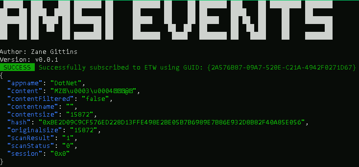

# GO-AMSI

Simple tool to subscribe to AMSI events written in go. 

Code is heavily based on example from [bi-zone/etw](https://github.com/bi-zone/etw).

## Build

`go build .\amsi.go`

## Resources

* [bi-zone/etw](https://github.com/bi-zone/etw)
* [Obfuscated Script-based Malware Analysis with the Anti-Malware Scan Interface (AMSI) - Matt Graeber](https://www.youtube.com/watch?v=jixcNj-Mc40)